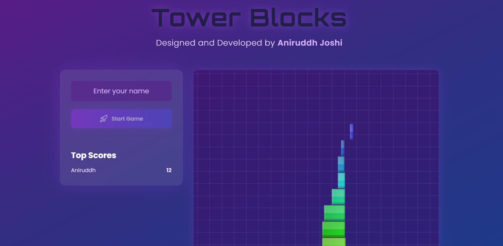

# 🏗️ Tower Block Game 🎮 

A fun and interactive **Tower Block Game** where you stack blocks to build the highest tower possible! Test your precision and timing skills.  

<p align="center">
  
</p>  

## 🔗 Live Demo  
🎮 **Play Now:** [aniruddh-tower-game.netlify.app](https://aniruddh-tower-game.netlify.app/)  

## 📌 Features  
✅ Addictive and engaging block-stacking gameplay  
✅ Smooth animations and responsive design  
✅ Simple yet challenging mechanics  
 
## 📥 Installation  
1. Clone the repository:  
   ```bash
   git clone https://github.com/aniruddh-joshi/Tower_Block_Game.git

## 📜 License
This project is open-source and available under the MIT License.

## 👨‍💻 Developed by Aniruddh Joshi
